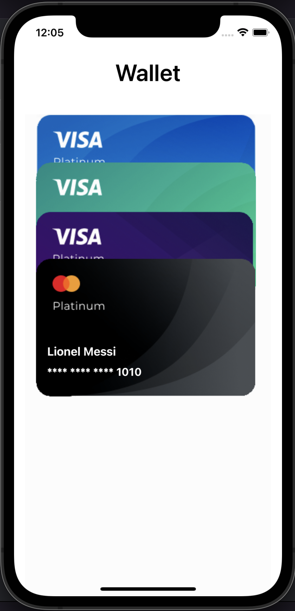

# Wallet

Wallet es una aplicación escrita en SwiftUI 3.0 usando los conceptos de la Arquitectura MVVM 🚀.

La Home muestra las tarjetas de crédito y diferentes animaciones entre las transiciones de pantallas.

## Requerimientos

- Swift 5.0+
- Xcode 13.0+
- iOS 15.0+ 

## ScreenShots 

| Wallet | Wallet | Wallet |
| :-: | :-: | :-: |
|  |  |  | 

## Features

* SwiftUI Animation Challenge
* SwiftUI Delay Animations 
* SwiftUI Delay List Animation
* SwiftUI Geometry Reader
* SwiftUI Matched Geometry Effect
* SwiftUI Overlay
* SwiftUI for iOS 15

  
## Author

* [**Maximiliano Morales**](https://github.com/maximorales90)

